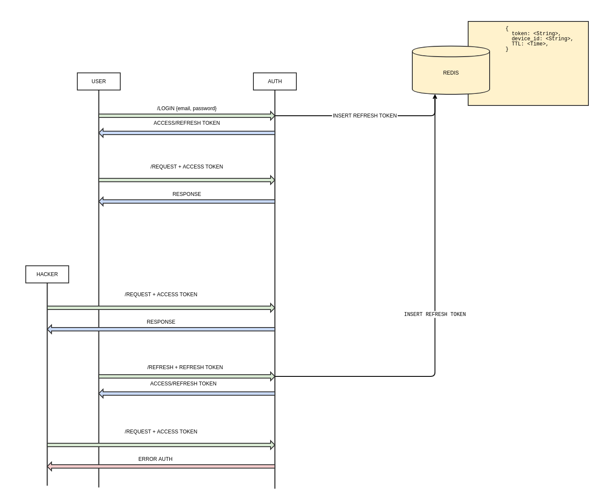

# go-auth-server

[](https://codeclimate.com/github/batazor/go-auth/maintainability)
[](https://microbadger.com/images/batazor/go-auth "Get your own image badge on microbadger.com")

Auth micro-service



### RUN

```
docker-compose build
docker-compose up
```

### ENV

| Name ENV         | Default value             |
|------------------|---------------------------|
| PORT             | 4070                      |
| MONGO_URL        | localhost/auth            |

### Generation cert

```
openssl genrsa \
    -passout pass:12345678 \
    -out cert/private_key.pem \
    2048
    
openssl rsa \
    -passin pass:12345678 \
    -in cert/private_key.pem \
    -pubout > cert/public_key.pub
```

### technology stack

#### Back-End

* Go
* MongoDB

### Kubernetes

```
# Run minikube
minikube start \
  --network-plugin=cni \
  --kubernetes-version=v1.8.0
  
# Install Helm
# See https://github.com/kubernetes/helm/blob/master/docs/install.md
helm init
helm repo update

# Run application
helm \
  --kube-context minikube \
  install \
  --name go-auth \
  --namespace=demo \
  ops/Helm/go-auth
```
